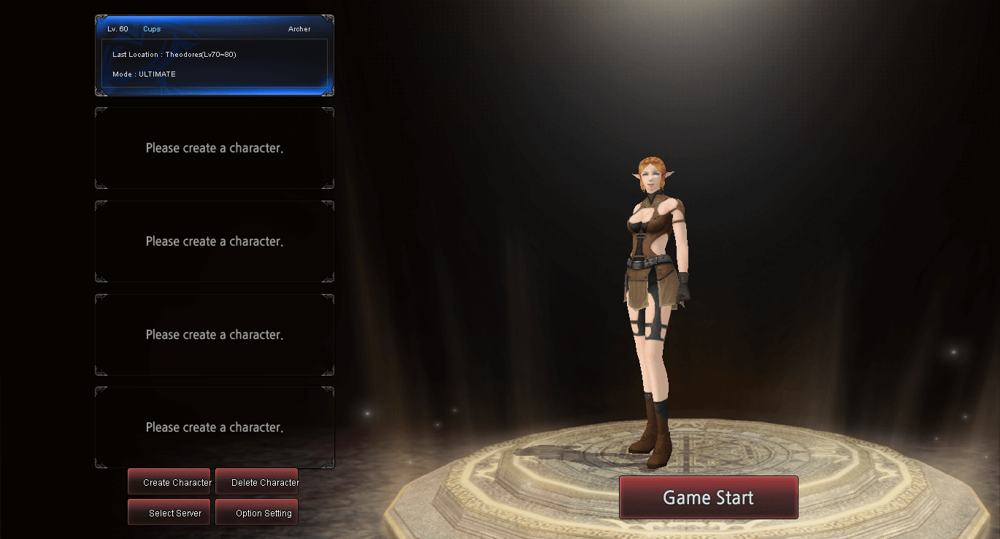
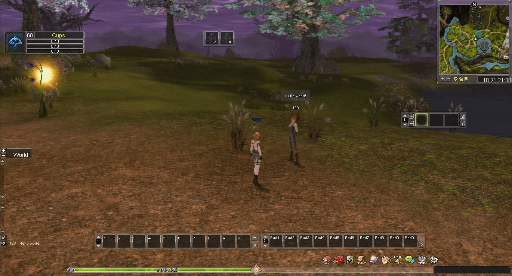

# Shaiya Eden
Eden is designed to be a high performance Shaiya emulator, with a strong focus on being as flexible and user-friendly as possible. It is designed to run with a PostgreSQL database backend, and uses Lua for content scripting. This is intended to be a successor to the learning project that was [Shaiya Genesis](https://github.com/TristonPlummer/ShaiyaGenesisLegacy).

## Troubleshooting
- *Where can I get a client?*
    - Eden is designed to run on an Ep8 client, which may be downloaded from [Elitepvpers](https://www.elitepvpers.com/forum/shaiya-pserver-development/4528336-new-episode-8-unpack.html).

## FAQ
#### I would like a feature added to the server
- If you would like a new feature added, you can either create a new feature request issue and describe the feature in depth, or you can develop the feature yourself and submit the updated code as a pull request.
#### I found a bug, where can I report it?
- You can report bugs as issues on Github.

## Media

## Acknowledgments
* #### Steimoni
    - For helping me out with my first prototype by providing me with a starting point in removing the encryption algorithm.
    
* #### Nubness & JuuF
    - For helping me out with the many questions I had when I was first getting in to Shaiya development.

* #### [Anna Melashkina](https://github.com/aosyatnik)
    - Inspiring me to make this project by continuing to work on open source Shaiya development, and for providing excellent insight on the encryption methods used in the Shaiya protocols.